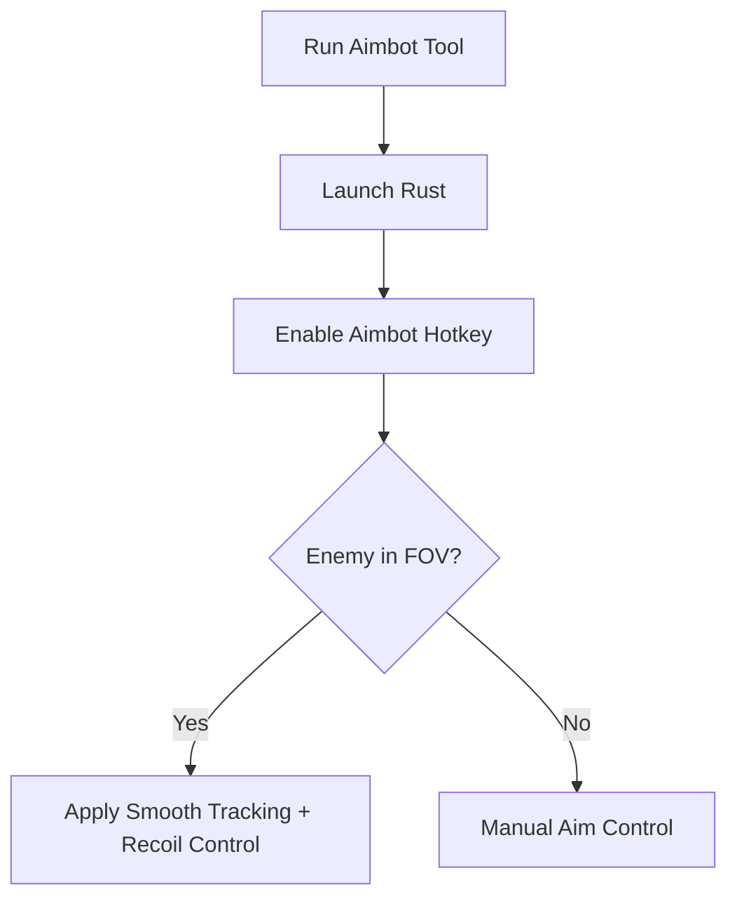

# Rust Aimbot 🎯

The **Rust Aimbot Software** is made for players who want sharper, more reliable targeting in Rust’s unforgiving survival world. With **smooth tracking, customizable FOV, and recoil balancing**, it lets you practice accuracy, conserve ammo, and refine gunplay in private or offline sessions.

---

## 📝 Overview

Rust’s gunfights are intense—spray patterns, recoil, and sudden ambushes punish missed shots. The aimbot helps by providing **natural tracking curves and head/torso prioritization**, making aim feel fluid and controlled while keeping it customizable to your preferences.

\[!WARNING]
This software is intended for **offline/private servers and training only**.

---

## ⭐ Features

* **Configurable FOV Lock** – Define how wide your aim assist zone is.
* **Smooth Tracking** – Adjustable speed curves for natural aim flow.
* **Recoil Control** – Stabilize weapon spray for consistent hits.
* **Target Prioritization** – Focus on nearest, head, or torso.
* **Weapon Profiles** – Save configs for rifles, SMGs, or bows.
* **Hotkey Toggle** – Turn aimbot on/off instantly.

---

## 🖥 Compatibility

| Platform       | Supported | Notes                      |
| -------------- | --------- | -------------------------- |
| Windows 10/11  | ✅         | Fully supported            |
| Steam          | ✅         | Stable overlay integration |
| Linux (Proton) | ⚠️        | Partial support            |
| Consoles       | ❌         | Not supported              |

\[!NOTE]
Accessibility: Overlay indicators (FOV circles, status icons) can be recolored, resized, and repositioned.

---

## ⚡ Setup Guide

1. **Download** the Rust Aimbot package.
2. Extract into your Rust root folder.
3. Run `Rust_Aimbot.exe` as administrator.
4. Launch Rust and press `F2` to activate aim assist.
5. Adjust settings via overlay or `config.ini`.

```ini
[aimbot]
fov=80
smooth=7
recoil_control=true
priority=head
hotkey=VK_RBUTTON
```

---

## 🔄 Aimbot Workflow



---

## ❓ FAQ

**Q: How is this different from aim assist?**
A: Aim assist offers gentle guidance, while the aimbot provides stronger, customizable tracking.

**Q: Can I disable recoil control?**
A: Yes, toggle it in the config file.

**Q: Will this damage my saves?**
A: No, it runs in memory only.

**Q: Can I make multiple configs?**
A: Yes, weapon-specific profiles are supported.

**Q: Does it reduce FPS?**
A: No, the software is lightweight and optimized.

---

## 🚀 Final Thoughts

The **Rust Aimbot Software** improves combat precision with **smooth tracking, recoil balancing, and targeting options**, making it a powerful training companion for mastering survival firefights.

---

